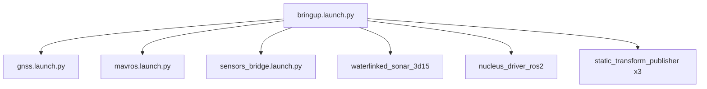

# mr_pinchy_bringup

ROS 2 (Humble) bringup package for **Mr Pinchy** — the single entry point for vehicle hardware: GNSS, FCU link (MAVROS), sonar, DVL, sensor bridges, and static transforms.

## Prerequisites

- ROS 2 Humble
- A built workspace containing:
  - [ublox_dgnss](https://github.com/aussierobots/ublox_dgnss) (`ublox_dgnss`, `ublox_dgnss_node`, `ublox_nav_sat_fix_hp_node`)
  - `mavros`
  - `waterlinked_sonar_3d15`
  - `nucleus_driver_ros2` and `interfaces` (from [nucleus_driver](https://github.com/nortekgroup/nucleus_driver))
  - `smarc_msgs`

## Building

```bash
cd ~/sonar_ws
colcon build --packages-select mr_pinchy_bringup
source install/setup.bash
```

## Launch files

### Scope

| Launch file | Scope | Use when |
|---|---|---|
| `bringup.launch.py` | **Full vehicle** — GNSS, sonar, MAVROS, Nucleus DVL, bridges, static TFs | Default on-vehicle boot; one command for everything |
| `gnss.launch.py` | **GNSS only** — u-blox driver, NTRIP, NavSatFix | Testing GPS independently |
| `mavros.launch.py` | **FCU link only** — PX4 MAVROS node | FCU debugging; included by bringup |
| `sensors_bridge.launch.py` | **Bridge nodes only** — DVL/depth/IMU/AHRS converters | Bridge debugging; included by bringup |



### Full bringup

```bash
ros2 launch mr_pinchy_bringup bringup.launch.py
```

Launch profiles (set subsystem defaults; see [Vehicle configuration](#vehicle-configuration)):

| Profile | GNSS | Sonar | DVL | MAVROS | Use when |
|---|---|---|---|---|---|
| `full` (default) | on | on | on | on | Normal on-vehicle operation |
| `sensors_only` | off | on | on | on | GNSS already running or not needed |
| `gnss_only` | on | off | off | off | GPS testing only |
| `sim` | off | off | off | off | Bag replay — static TFs and bridges only |

```bash
ros2 launch mr_pinchy_bringup bringup.launch.py profile:=sensors_only
ros2 launch mr_pinchy_bringup bringup.launch.py profile:=gnss_only
ros2 launch mr_pinchy_bringup bringup.launch.py profile:=sim
```

Arguments:

| Argument | Default | Description |
|---|---|---|
| `vehicle_config` | `config/pinchy.yaml` | Vehicle YAML (IPs, extrinsics, bridge defaults) |
| `profile` | `full` | Launch preset: `full`, `sensors_only`, `gnss_only`, `sim` |
| `log_level` | `INFO` | ROS log level for GNSS nodes |
| `gnss` | _(empty)_ | Override GNSS enable (`true`/`false`; empty = use profile) |
| `sonar` | _(empty)_ | Override sonar enable |
| `dvl` | _(empty)_ | Override DVL enable |
| `mavros` | _(empty)_ | Override MAVROS enable |
| `nucleus_ip` | _(empty)_ | Nucleus DVL IP (empty = use vehicle config) |
| `fcu_url` | _(empty)_ | MAVROS FCU URL (empty = use vehicle config) |
| `sonar_params_file` | _(empty)_ | Sonar params YAML (empty = use vehicle config) |

Disable individual subsystems (overrides profile):

```bash
ros2 launch mr_pinchy_bringup bringup.launch.py sonar:=false dvl:=false
```

### Sensors & FCU without GNSS

Use the `sensors_only` profile (or `gnss:=false`) when GNSS is already running elsewhere or not needed:

```bash
ros2 launch mr_pinchy_bringup bringup.launch.py profile:=sensors_only
ros2 launch mr_pinchy_bringup bringup.launch.py profile:=sim
```

Key topics started: MAVROS topics under `/mavros/`, sonar point cloud from `waterlinked_sonar_3d15`, Nucleus packets on `/nucleus_node/*`, bridged outputs on `/dvl/*` and `depth_odom`.

Static TF frames: `base_link` → `sonar_link`, `hd_camera_link`, `dvl_link`.

### GNSS

```bash
ros2 launch mr_pinchy_bringup gnss.launch.py
```

Arguments:

| Argument | Default | Description |
|---|---|---|
| `log_level` | `INFO` | ROS log level |
| `gnss_params_file` | `config/gnss.yaml` | Path to GNSS parameter overrides |
| `secrets_file` | `config/secrets.yaml` | NTRIP credentials |

Verify output:

```bash
ros2 topic echo /fix
```

### Sensor bridges

```bash
ros2 launch mr_pinchy_bringup sensors_bridge.launch.py
```

Arguments:

| Argument | Default | Description |
|---|---|---|
| `dvl_type` | `nucleus` | DVL model: `nucleus`, `waterlinked`, or `sim` |
| `dvl_topic` | _(empty)_ | DVL input topic override |
| `dvl_frame` | _(empty)_ | DVL TF frame override |
| `depth_topic` | _(empty)_ | Depth input topic override |
| `depth_frame` | _(empty)_ | Depth output frame override |
| `relative_depth` | `True` | Treat depth as relative (offset on first reading) |
| `ned` | `True` | Depth reading is in NED frame |
| `ahrs` | `False` | Enable Nucleus AHRS bridge |

When launched via `bringup.launch.py`, bridge settings come from `config/pinchy.yaml` under the `bridges:` key.

Note: only Nucleus bridge executables are installed in this package. Selecting `waterlinked` or `sim` for `dvl_type` will fail at runtime.

## Vehicle configuration

Vehicle-specific settings live in [`config/pinchy.yaml`](config/pinchy.yaml). Edit this file instead of hardcoding values in launch files.

| Section | Contents |
|---|---|
| `network` | Nucleus IP, MAVROS FCU URL, sonar params file path, DVL connect delays |
| `subsystems` | Default enable flags for GNSS, sonar, DVL, MAVROS |
| `extrinsics` | Static transforms from `base_link` to sonar, camera, and DVL frames |
| `bridges` | DVL type, frames, depth topic, AHRS enable |

Sonar network settings (IP, interface, UDP mode) live in [`config/sonar.yaml`](config/sonar.yaml), referenced from `pinchy.yaml`. This keeps all Mr Pinchy network addresses in one package.

Use a custom config file at launch time:

```bash
ros2 launch mr_pinchy_bringup bringup.launch.py vehicle_config:=/path/to/my_vehicle.yaml
```

Launch arguments override config values when set explicitly (non-empty). Profiles override `subsystems` defaults unless individual `gnss`/`sonar`/`dvl`/`mavros` args are passed.

## Bridge nodes

Python bridge nodes in `scripts/` convert vendor-specific messages to standard ROS types:

| Node | Input topic(s) | Output topic | Message types | Purpose |
|---|---|---|---|---|
| `nucleus_dvl_bridge` | `/nucleus_node/bottom_track_packets` | `/dvl/velocity` | `interfaces/BottomTrack` → `TwistWithCovarianceStamped` | Nucleus bottom-track velocity to standard DVL twist |
| `depth_bridge` | `/global_position/rel_alt` (+ `global_position/global` for stamp) | `depth_odom` | `Float64` → `PoseWithCovarianceStamped` | FCU relative altitude to depth pose (z only) |
| `nucleus_imu_bridge` | `/nucleus_node/imu_packets` | `/dvl/imu` | `interfaces/IMU` → `sensor_msgs/Imu` | Raw Nucleus IMU to standard Imu |
| `nucleus_ahrs_bridge` | `/nucleus_node/ahrs_packets` | `/dvl/ahrs_imu` | `interfaces/AHRS` → `sensor_msgs/Imu` | Nucleus AHRS orientation to Imu (orientation only) |

Each node accepts ROS parameters to override `frame_id`, input/output topics, and other settings. See the node source in `scripts/` for the full parameter list.

## Package dependencies

### This package provides

- Launch orchestration for Mr Pinchy
- Sensor bridge nodes (DVL, depth, IMU, AHRS)
- GNSS NTRIP client script

### Required workspace packages

| Package | Role |
|---|---|
| `ublox_dgnss`, `ublox_dgnss_node`, `ublox_nav_sat_fix_hp_node` | GNSS driver stack |
| `mavros` | FCU communication (PX4) |
| `waterlinked_sonar_3d15` | 3D sonar driver |
| `nucleus_driver_ros2`, `interfaces` | Nortek Nucleus DVL driver + messages |
| `smarc_msgs` | SMARC message types used by DVL bridge |

### ROS / system dependencies

Declared in `package.xml`:

- `launch`, `launch_ros`, `launch_xml`, `ament_index_python`, `rclpy`
- `tf2_ros`
- `geometry_msgs`, `nav_msgs`, `sensor_msgs`, `std_msgs`, `rtcm_msgs`
- `python3-numpy`, `python3-yaml`

## Configuration

Vehicle-specific parameters live in `config/`. Edit these instead of modifying launch files.

| File | Purpose |
|---|---|
| `pinchy.yaml` | Vehicle network IPs, extrinsics, bridge defaults, subsystem enables |
| `sonar.yaml` | Water Linked sonar IP, UDP/network, and acoustic settings |
| `gnss.yaml` | u-blox device family, measurement rates, USB message outputs |

### Secrets

Credentials (e.g. NTRIP for RTK corrections) should **not** be committed. Use one of:

- Environment variables referenced in launch files
- A `config/secrets.yaml` file added to `.gitignore`

A template is provided at `config/secrets.yaml.example` (when RTK is configured).

## Hardware

### GNSS (u-blox)

The u-blox receiver appears as `/dev/gnss0` → `/dev/ttyACM0` over USB. No udev rules are needed for basic operation, but if the device index changes you can add a rule:

```
# /etc/udev/rules.d/99-ublox.rules
SUBSYSTEM=="tty", ATTRS{idVendor}=="1546", ATTRS{idProduct}=="*", SYMLINK+="ublox_gnss", MODE="0666"
```

Then reload with `sudo udevadm control --reload-rules && sudo udevadm trigger`.

### Nucleus DVL

IP and connect timing are set in `config/pinchy.yaml` under `network:`. Override at launch with `nucleus_ip:=192.168.x.x`. The driver connects automatically after `nucleus_connect_delay` seconds (default 3) and begins streaming after `nucleus_start_delay` seconds (default 6).

### Sonar

Water Linked 3D15 sonar settings are in `config/sonar.yaml` (IP, interface, UDP mode). Static extrinsic is in `config/pinchy.yaml` under `extrinsics:`. Override the params file at launch with `sonar_params_file:=/path/to/sonar.yaml`.
